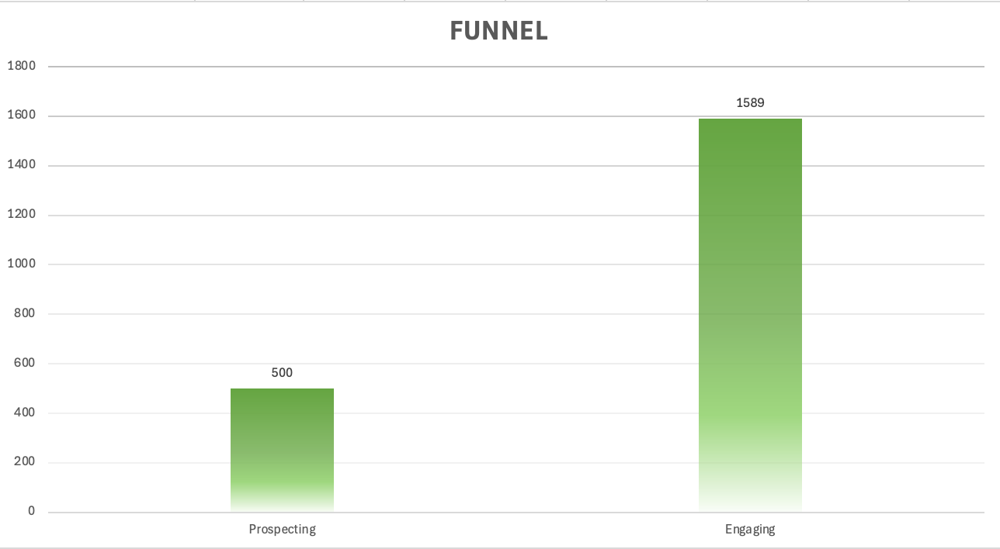
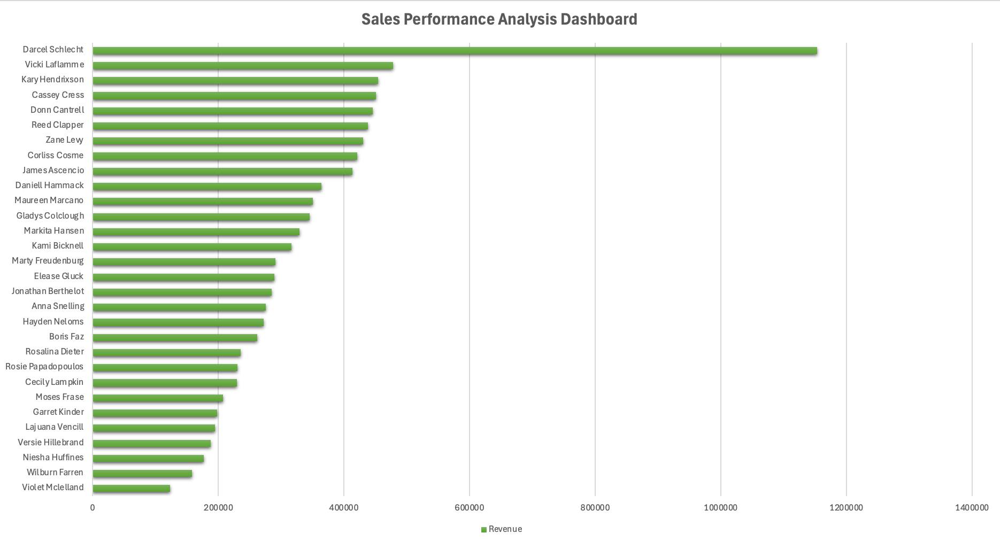

# 📊 Sales Performance Analysis Dashboard

## 📌 Project Overview
This project analyzes sales performance using an Excel dashboard.  
The goal is to evaluate revenue, conversion rates, and sales agent performance.

---

## 📊 Dataset
- Source: Sales Opportunities dataset  
- Total deals: 8,800  
- Includes information about sales agents, deal stages, revenue, and timing  

---

## 🛠 Tools Used
- Microsoft Excel  
- Pivot Tables  
- Data Cleaning  
- Data Visualization  

---

## 📈 Key Metrics
- Total Revenue: $10M  
- Total Deals: 8,800  
- Won Deals: 4,238  
- Conversion Rate: 48%  
- Average Deal Size: $2,360  

---

## 🔍 Key Insights

### Sales Performance
- Top revenue is generated by Darcel Schlecht, primarily driven by a high number of deals  
- No strong correlation between number of deals and revenue  
- Indicates variation in deal size and sales strategies  

---

### Funnel Analysis
- Funnel shows inconsistencies in the data  
- Later stages contain more deals than earlier stages  
- Conversion rate exceeds 100%  

👉 This indicates data quality issues or incomplete tracking  

---

## ⚠️ Data Issues
- Inconsistent funnel structure  
- Missing early-stage deals  
- Possible tracking limitations  

---

## 📷 Dashboard Preview

---

## 📁 Project Structure
- raw dataset  
- final Excel dashboard  
- visualization preview  

---

## 🚀 What I Learned
- Data cleaning and validation  
- Building dashboards in Excel  
- Identifying data quality issues  
- Translating data into business insights  
